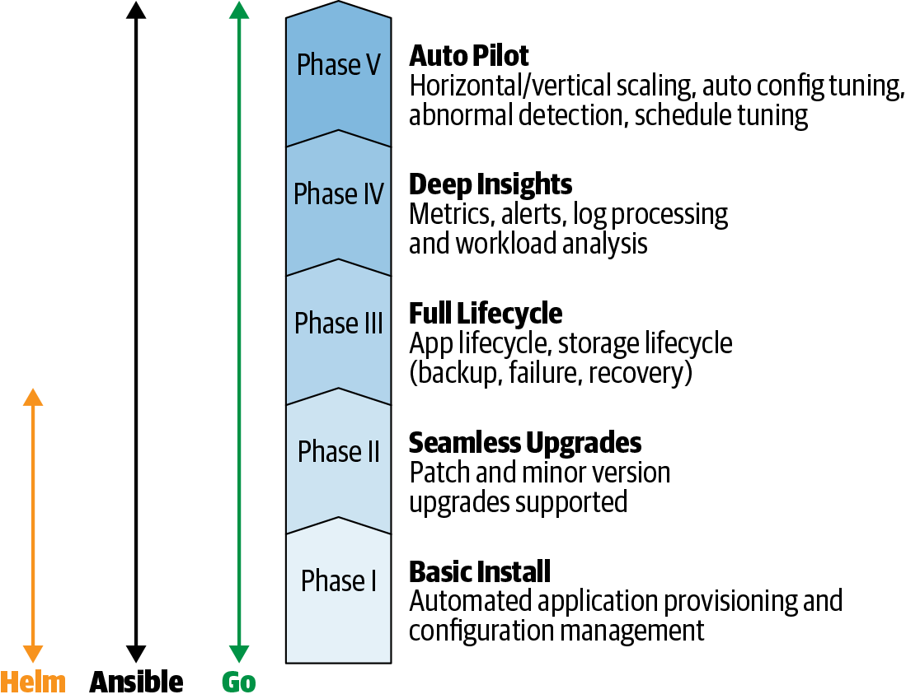

# Operator框架

[TOC]

在开发 *Operator* 以及管理其分发、部署和生命周期的过程中不可避免地会出现复杂性。 *Red Hat Operator Framework* 使创建和分发 *Operator* 变得更加简单。 它使用软件开发工具包 (SDK) 可以更轻松地构建 Operator，该工具包可以自动执行大部分重复的实现工作。 该框架还提供了用于部署和管理 Operator 的机制。 *Operator Lifecycle Manager* (*OLM*) 是安装、管理和升级其他 *Operator* 的 *Operator*。 Operator Metering 是一个衡量 Operator 使用集群资源的指标系统。
本章概述了框架的这三个关键部分，以帮助您准备使用这些工具来构建和分发示例 Operator。 在此过程中，您将安装 *operator-sdk* 命令行工具，这是 SDK 功能的主要接口。

## Operator框架起源
*Operator SDK* 构建在 Kubernetes 控制器运行时 (https://oreil.ly/AM0TP) 之上，这是一组以 Go 编程语言提供基本 Kubernetes 控制器例程的库。 作为 *Operator Framework* 的一部分，*SDK* 提供了集成点，如用于使用 *OLM* 分发和管理 *Operator*、使用 *Operator Metering* 对其进行度量。 *SDK* 和整个RedHat Operator Framework是开源的，来自整个社区和其他组织的贡献者，并且正在捐赠 (https://oreil.ly/KoyS6) 给供应商中立的云原生计算基金会 (https://www.cncf.io/)，云原生计算基金会本身也是Kubernetes 和许多其他相关项目的所在地。

## Operator成熟度模型
图 4-1 中描述的Operator成熟度模型描绘了一种考虑不同级别Operator功能的方法。 您可以从安装其Operand的最小可行产品开始，然后添加生命周期管理和升级功能，随着时间的推移迭代以实现应用程序的完全自动化。



图 4-1 Operator成熟度模型

Operator可以从简单粗糙开始，并在一系列开发周期中逐渐成熟。 模型的第一阶段需要足够的特定于应用程序的代码来创建Operand所需的任何资源。 换句话说，第一阶段是准备好、自动安装应用程序。

## Operator SDK
*Operator SDK* (https://oreil.ly/IcfRf) 是一组用于搭建、构建和准备 Operator 以进行部署的工具。 SDK 目前包括了对使用 Go 编程语言构建 Operator 的提供一级（First Class）支持，并计划支持其他语言。 *SDK* 还为 *Helm* (https://oreil.ly/IYH2d) 图表或 *Ansible* (https://oreil.ly/ek6jP) *playbooks* 提供了可能被描述为适配器架构的东西。 我们将在第 6 章中介绍这些 *Adapter Operator*。在第 7 章中，我们将展示如何在 *Go* 中实现特定于应用程序的管理例程，以使用 *SDK* 工具构建自定义 *Operator*。


### 安装 Operator SDK 工具
*Operator SDK* 以命令行工具 *operator-sdk* 为中心，可帮助您构建 *Operator*。*SDK* 采用标准项目布局，作为回报，为基本的 *Kubernetes API* 控制器的实现创建了 *Go* 源代码骨架（*skeletal*），并为您的*应用程序特定的处理程序（application-specific handlers）*创建占位符。并基于此，*SDK* 提供了用于构建 *Operator* 并将其包装在 *Linux* 容器中的便利命令，生成在 *Kubernetes* 集群上部署 Operator 所需的 *YAML* 格式的 *Kubernetes Manifest*。

#### 二进制安装
要为您的操作系统安装二进制文件，请从 Kubernetes SDK 存储库 (https://oreil.ly/TTnC6) 下载 *operator-sdk*，修改可执行权限，然后将其添加到 $PATH 中。 
该程序是静态链接的(statically linked)，因此可以在有可用版本的平台上运行。 在撰写本文时，该项目为 _x86-64_ 架构上的 _macOS_ 和 _Linux_ 操作系统提供构建。 

 对于像 operator-sdk 这样快速发展的项目，最好查看项目的安装说明 (https://oreil.ly/ZbaBT) 以了解最新的安装方法。


####  源代码安装
要获取最新的开发版本，或者对于没有二进制分发的平台，请从源代码构建 operator-sdk。 我们假设你已经安装了 _git_ 和 _go_：

```shell
$ go get -d github.com/operator-framework/operator-sdk
$ cd $GOPATH/src/github.com/operator-framework/operator-sdk
$ git checkout master
$ make tidy
$ make install
```
成功构建后会将 operator-sdk 二进制文件写入您的 $GOPATH/bin 目录。 运行 operator-sdk 版本以检查它是否在您的 $PATH 中。

这是获取 SDK 工具最常用和最少依赖的两种方式。其他选项请查看项目的安装文档(https://oreil.ly/fAC1b).本书后续示例使用0.11.x 系列版本*operator-sdk*。

## Operator Lifecycle Manager
*Operator*解决了任何平台上的任何应用程序都必须随着时间的推移而被获取、部署和管理的一般原则。 Operator 本身就是 Kubernetes 应用程序。当 Operator 管理其Operand时，是什么来管理 *Operator*？

*Operator Lifecycle Manager* (https://oreil.ly/SDL7q) 将 *Operator* 模式提升到了一个层次：它是一个 *Operator*，在 *Kubernetes* 集群上获取、部署和管理 *Operator*。与任何应用程序的 *Operator* 一样，OLM 通过自定义资源（*CR*）和自定义控制器来扩展我们的*Kubernetes*，因此 我们也可以使用 Kubernetes 工具使用Kubernetes API 对OLM进行声明式管理。

OLM 为 Operator 的元数据定义了一个模式，称为集群服务版本 (Cluster Service Version,CSV)，用于描述 Operator 及其依赖项。具有 CSV 的 Operator 可以作为目录中的条目被列出，可以供在 Kubernetes 集群上运行的OLM 使用。用户可以从目录（*catalog*）中订阅（*subscribe*） *Operator*，让 *OLM* 配置（*provision*）和管理我们所需的 *Operator*。同样的，该 *Operator* 在集群上配置和管理其应用程序或服务。

根据 *Operator* 在其 *CSV* 中提供的描述和参数，OLM 可以在其生命周期内管理 Operator：监控其状态、采取措施使其保持运行、在集群上的多个实例之间进行协调以及将其升级到新版本。反过来，Operator可以使用应用程序最新版本的最新自动化功能来控制其应用程序。


## Operator Metering
*Operator Metering* 是一个用于分析在 *Kubernetes* 集群上运行的 *Operator* 的资源使用情况的系统。 *Metering* 分析 *Kubernetes CPU*、memory和其他资源指标，
以计算基础设施服务的成本。它还可以检查特定于应用程序的指标，例如根据使用情况对应用程序用户进行计费所需的指标。 Metering 为运营团队提供了一个模型，用于将云服务或集群资源的成本映射到应用程序、命名空间和使用它的团队。这是一个平台，您可以在该平台上构建针对您的 *Operator* 及其管理的应用程序的定制报告，帮助完成三个主要活动：

* 预算：在集群上使用 Operator 时，团队可以深入了解基础设施资源的使用方式，尤其是在自动扩展集群或混合云部署中，帮助改进预测和分配以避免浪费。
* 计费：当您构建一个向付费客户提供服务的 Operator 时，可以通过反映 Operator 和应用程序内部结构的计费代码或标签来跟踪资源使用情况，以计算准确和明细的账单。
* 指标聚合：可以跨命名空间或团队查看服务使用情况和指标。例如，它可以帮助您分析 PostgreSQL 数据库Operator消耗的资源，该数据库Operator运行许多数据库服务器集群和许多数据库，供共享大型 Kubernetes 集群的不同团队使用。

## 总结
本章介绍了 Operator Framework 的三大支柱：用于构建和开发 Operator 的 Operator SDK； Operator Lifecycle Manager 用于分发、安装和升级它们； 和 Operator Metering，用于测量 Operator 绩效和资源消耗。 这些框架元素一起支持创建 Operator 并保持其运行的过程。
您还安装了 operator-sdk 工具，因此您配备了构建 Operator 的主要工具。 首先，我们将首先介绍您将构建一个 Operator 来管理的示例应用程序，即访客站点。


